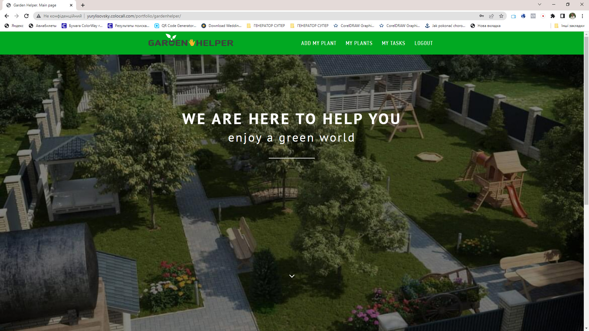
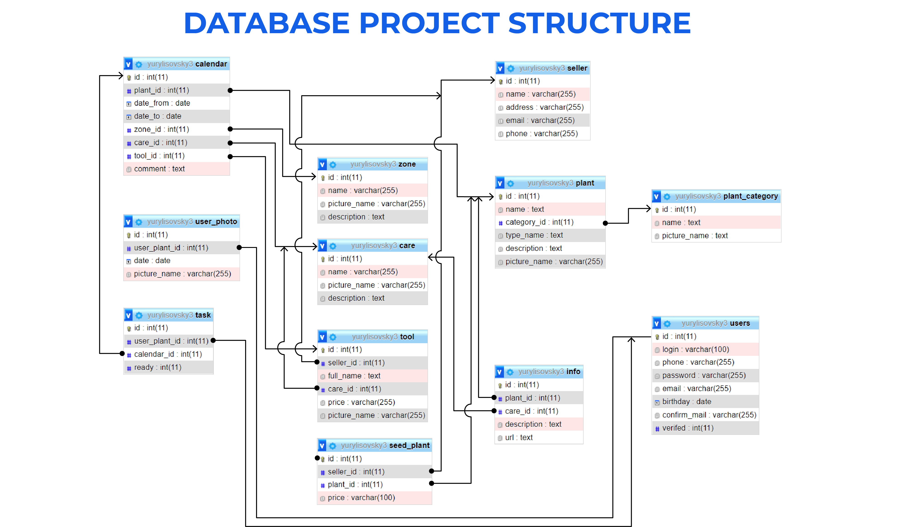
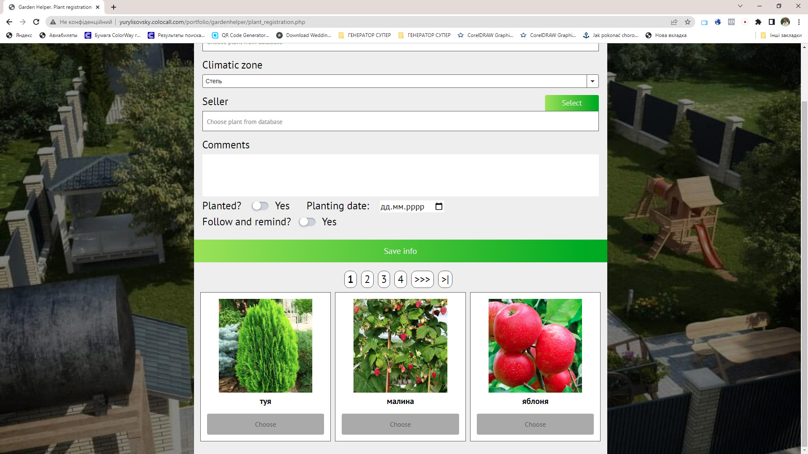

<h1 align="center">Study Project GardenHelper</h1>

<!--  -->

<h2 align="center"><a  href="http://yurylisovsky.colocall.com/portfolio/gardenhelper/">Watch project</a></h2>

## Description

The idea of ​​the project was born from life. Many people love plants and love to grow them in the garden, vegetable garden, apartment. But for quality care you need to follow many rules. Remember care dates and names of remedies and recipes. I want to be reminded when and how to care for plants. It is interesting to have photos taken in different periods of plant life. This project was developed for this purpose.
<!-- Ідея проекту народилася з життя. Багато хто любить рослини і любить їх вирощувати в саду, городі, квартирі. Але для якісного догляду треба дотримуватись багатьох правил. Пам'ятати дати догляду та назви засобів та рецепти. Хочеться щоб було нагадування коли і як доглядати рослини. Цікаво мати фото зроблені в різні періоди життя рослини. Цей проект розроблявся саме для цього. -->

## About the project.

This project is part of a training of skills in the course of study. In it I passed the following stages: development of the idea of ​​the project, designing of a database, partial development of a frontend part, programming of a backend part (PHP). Requests were made using AJAX. Data processing in JSON format
<!-- Цей проект є частиною тренування навичок в курсі навчання. В ньому я проходив наступні етапи: розробка ідеї проекту, проектування бази даних, часткова розробка фронтенд частини, програмування бекенд частини (PHP). Запити робились за допомогою AJAX. Обробка даних в форматі JSON -->

### The structure of the database has been developed

### The project is based on Ajax queries and data processing in JSON format

## This project used:

HTML, CSS, JavaScript, PHP, Ajax, JSON, SQL, DataBase

## Another similar project

### Shopping Guide

<h3 align="center"><a  href="https://github.com/yurlis/shoppingguide">Go to ShoppingGuide project on GitHub</a></h3>
